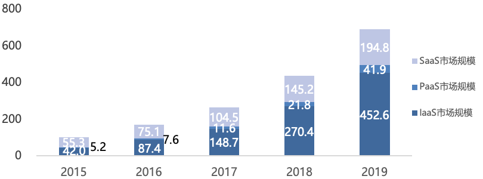

# （一）云原生产业规模分析

2019年我国公有云PaaS市场规模继续保持高速增长，市场规模为41.9亿元，同比增长92.4%。私有云市场规模为645.2亿元，同比增长22.8% 。云原生相关产业作为现阶段云计算PaaS市场的重要支点，也延续了高速增长态势，根据中国信息通信研究院相关调研数据显示，**2019年我国云原生相关产业的市场规模已达350.2 亿元。** 数字经济大潮下传统行业的数字化转型成为云原生产业发展的强劲驱动力，“新基建”带来的万亿级资本投入，也将在未来几年推动云原生产业的发展迈向新阶段。

我国云原生产业发展已呈现几个明显特征：**大中型互联网企业主导云原生产业发展，技术应用快速向垂直行业扩展。** 超6成的云原生技术用户为互联网企业，其中千人以上企业规模的企业占比高达35.11% ，互联网头部企业在云原生产业发展中举足轻重。同时金融、制造、服务业、政务、电信等垂直行业的应用占比有所攀升，行业数字化转型的带动效应初步显现；**云原生技术在传统领域尚处发展期IT技术投入占比较低，技术研发是资金流出的主要方向。** 80%的调研企业在云原生技术领域的投入不足整体IT投入的30% ，云原生架构尚未成为企业数字基础设施建设的核心支柱，有近7成的用户表示投入的资金主要用于相关技术的研发；**云原生架构采纳用户的生产集群以中小型规模为主，规模化应用仍存在较高技术门槛。** 云原生技术栈在规模化应用时的安全性、连续性及性能等因素成为用户侧落地的主要顾虑（调查占比为61%），同时陡峭的学习曲线以及与现有平台的整合演进也成为用户摇摆的重要因素（调查占比分别为47%和46% ）。