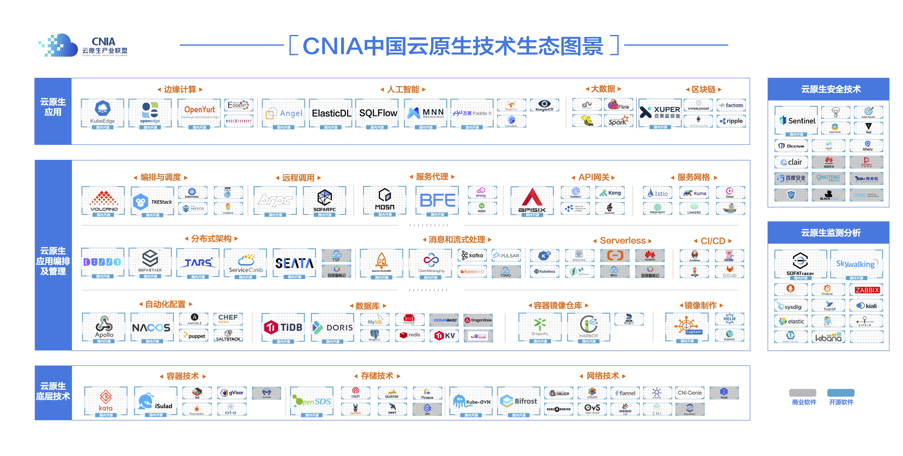

# (三)	云原生技术生态分析

云原生的理念经过几年发展，不断丰富、落地、实践，云原生已经渡过了概念普及阶段，进入了快速发展期。云原生技术以其高效稳定、快速响应的特点驱动引领企业的业务发展，帮助企业构建更加适用于云上的应用服务。过去几年中，云原生关键技术正在被广泛采纳，如43.9% 的用户已在生产环境中采纳容器技术，超过七成的用户已经或计划使用微服务架构进行业务开发部署等，这使得用户对云原生技术的认知和使用进入新的阶段，技术生态也在快速的更迭，特征明显。

**云原生技术生态日趋完善，细分项目不断涌现。** 相较于早年的云原生技术生态主要集中在容器、微服务、DevOps等技术领域，现如今的技术生态已扩展至底层技术、编排及管理技术、安全技术、监测分析技术以及场景化应用等众多分支，初步形成了支撑应用云原生化构建的全生命周期技术链。同时细分领域的技术也趋于多元化发展，如在容器技术领域，从docker这种通用场景的容器技术逐渐演进出安全容器、边缘容器、serverless容器、裸金属容器等多种技术形态。

**开源技术主导生态，本土力量日益凸显。** “软件即服务”的概念逐渐深入人心，在云计算服务化转型的大趋势下，软件开源的经营模式逐渐成为主流，开源的价值也被国内外的公司所深刻认同：开源技术也有助于构建高质量的开发人员社区，实现全球精英人才的协同贡献，加速技术创新的覆盖率指数级增长。鉴于此，全球云计算厂商都在积极布局云原生开源项目，加速企业的技术竞争力。我国云原生技术领域也涌现出大量的国内公司主导的优质开源项目，本土开源力量在支撑国内需求的基础上开始反哺国际社区，如腾讯开源的微服务框架TARS贡献给了Linux基金会、阿里开源的分布式服务框架Dubbo贡献给了Apache基金会、容器镜像仓库项目Harbor已经从CNCF（云原生计算基金会）毕业深度应用于企业生产。