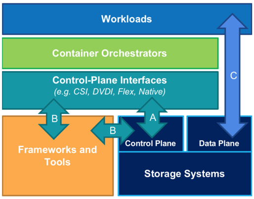
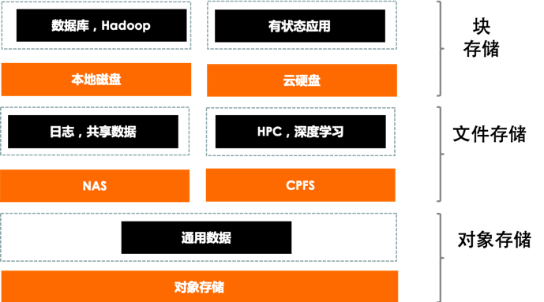

## 2.	云原生存储：加速云存储的云原生化改造

云原生存储是云原生应用场景下的存储解决方案，存储形态可为块、对象、文件、键值存储等。云原生存储可以以“声明”的形式被云原生应用申请使用，支持容器编排层对接存储控制面，完成对存储资源的生命周期管理。编排层与存储的交互架构如下图，通过控制面接口直接对接到编排层（下图中A所示）为应用负载提供存储资源的动态供应能力，通过API框架或者工具间接对接到编排层（下图中B所示），提供数据存储的一些高阶能力，如数据保护，数据迁移等。

**Kubernetes对云存储的原生调度方案难以满足云原生环境下企业核心/智能应用的部署需求。** 云原生技术已被企业广泛采用，应用容器化运行的比例大幅攀升，使用云原生存储来部署生产可用的有状态应用正呈现加速上升趋势。越来越多的互联网、数据库、消息队列等企业有状态核心应用，逐步迁移到云原生平台，对不同的云上块存储的性能在时延和吞吐，以及稳定性提出新的要求。随着云原生应用对可迁移性，扩展性和动态特性的需求，对云原生环境下的存储也提出了相应的密度、速度、混合度的新要求，对云存储基本能力之上又提出了在效率，弹性，自治，稳定，应用低耦合，GuestOS优化，安全等方面的诉求。

**云原生存储在数据、控制双平面提升存储使用效率与安全性。** 云原生存储是指通过整合多种云存储形态，完整匹配Kubernetes环境下的存储声明机制，提升存储的质量、稳定性及安全等能力，以满足不同应用场景下的存储使用需求的新型存储解决方案。当前主要有两种方式来构建云原生存储能力：**一是对已有存储系统的对接改造。** 这种构建方法适用于已经具备可用存储系统的公有云或私有云环境，通过标准的CSI接口来对接各类存储，完善和强化声明式接口以及原有存储系统能力（扩展性、性能、安全性、稳定性等）来构建云原生存储系统。这种构建方式可以复用云计算基础设施，无需重复发明轮子。**二是面向云原生场景设计全新的存储系统，** 构建云原生存储系统通常基于具体平台存储层（块或者文件）再构建一层分布式存储层，屏蔽不同平台的存储层差异，提高了应用部署的灵活性，使存储系统可以像云原生应用一样能被部署到任意平台上。

