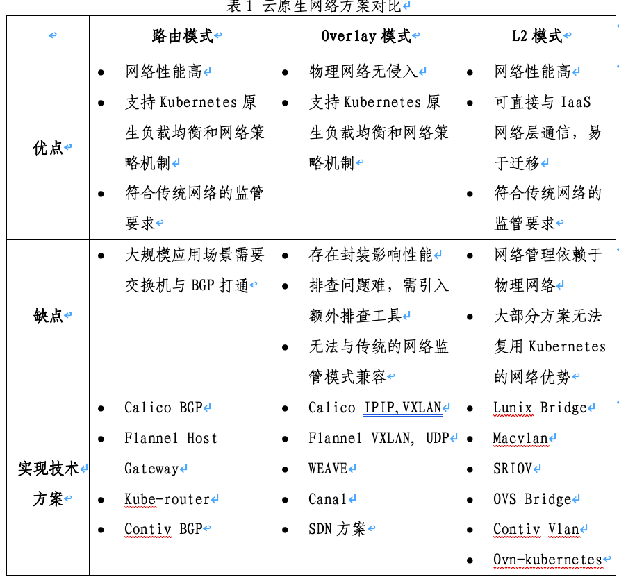

## 3.	云原生网络：面向用户应用场景不断演进

 云原生网络的基本目标是满足云原生服务的网络端点和服务间的互通性、安全性和负载均衡要求。Kubernetes已经成为容器编排的事实标准，容器网络也需与Kubernetes的调度机制相匹配。容器网络接口CNI(Conteinre Network Interface)是现行的网络接口标准， CNI接口只实现创建、删除容器时的调用方法，其他所有的网络能力都交由网络厂商实现增值服务，这在一定程度上加速了网络方案的繁荣，但是给用户的方案选型造成了较大困扰。大部分的用户场景都是基于网络的通讯协议进行方案选择，根据网络协议的不同，可将网络方案分为路由模式、Overlay和L2方案三种。

 

 自CNI标准发布到2020年，云原生网络已经演进近6年时间。也积累了大量的用户落地案例和大规模的实践案例。未来对于云原生网络的演进，依旧会在用户落地场景方向上深度演进。总结起来主要是以下几个趋势：

 **大规模、复杂的互访场景要求云原生网络扁平化。** 随着云原生技术的普及，容器集群规模快速增长，跨集群、跨VPC互访场景越来越丰富，这要求容器端点具有与宿主节点相同的互通能力，容器和服务具有独立VPC的子网地址，甚至具有独立的直通网口,这样在获得更高转发性能、更低损耗的同时，兼顾更好的隔离性。通过在容器挂接的网口配置安全组规则，能够实现容器级别的微分段网络管控策略。但是，容器端点规模和发放速度相对于现有VPC网络规格存在数量级的差距，规模扩展问题仍有待解决。

**eBPF等技术将有效改善容器网络复杂链路的高延时问题。** 容器网络中大量依赖了linux的网络虚拟化的技术，例如iptables、bridge等，这些复杂的链路导致网络延时显著增加。而在linux新版本内核中引入的ebpf/xdp技术可以通过可编程的方式去简化内核的网络转发链路，通过把ebpf 程序注入到了网卡中，大幅度降低了网络链路和复杂度，提升了网络的可靠性和性能，在未来会有广泛的应用。

**网络安全将成为云原生技术底座的重要组成部分，** 平台的安全问题在所有的平台演进和建设过程中一直扮演着非常重要，但是不十分紧急的角色，在容器安全建设上，大部分组织都是采取防守和被动姿态。但是本身在近几年陆续爆出大量的基于容器平台的安全隐患以及在国内“护网行动”的大背景之下，容器安全已经成为云原生底座无法绕开的一个问题，容器网络安全在整个底座安全里面扮演了非常重要的角色，也将成为之后的CNI网络演进的方向和趋势。