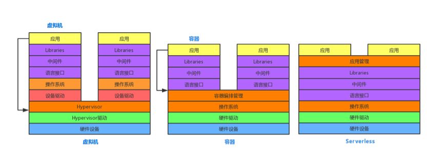
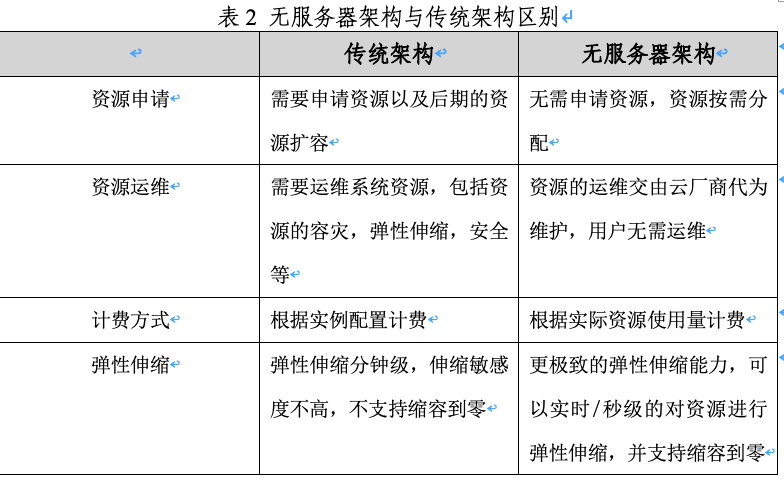

# 3.	无服务器架构技术

基础设施架构总是伴随软件架构演进。单体架构时代应用比较简单，应用的整体部署、业务的迭代更新，物理服务器的资源利用效率足以支撑业务的部署。随着业务的复杂程度飙升，功能模块复杂且庞大，单体架构严重阻塞了开发部署的效率，业务功能解耦，单独模块可并行开发部署的微服务架构逐渐流行开来，业务的精细化管理不可避免的推动着基础资源利用率的提升。虚拟化技术打通了物理资源的隔阂，减轻了用户管理基础架构的负担。容器/PaaS平台则进一步抽象，提供了应用的依赖服务、运行环境和底层所需的计算资源。这使得应用的开发、部署和运维的整体效率再度提升。无服务器架构技术则将计算抽象的更加彻底，将应用架构堆栈中的各类资源的管理全部委托给平台，免去基础设施的运维，使用户能够聚焦高价值的业务领域。

 

无服务器是一种架构理念，其核心思想是将提供服务资源的基础设施抽象成各种服务，以API接口的方式供给用户按需调用，真正做到按需伸缩、按使用收费。这种架构体系结构消除了对传统的海量持续在线服务器组件的需求，降低了开发和运维的复杂性，降低运营成本并缩短了业务系统的交付周期，使得用户能够专注在价值密度更高的业务逻辑的开发上。

 

 在无服务器架构的理念和方法下，有很多种无服务器的技术形态，目前成熟落地的有3种形态，函数即服务（FaaS）、后端即服务（BaaS）和Serverless容器。