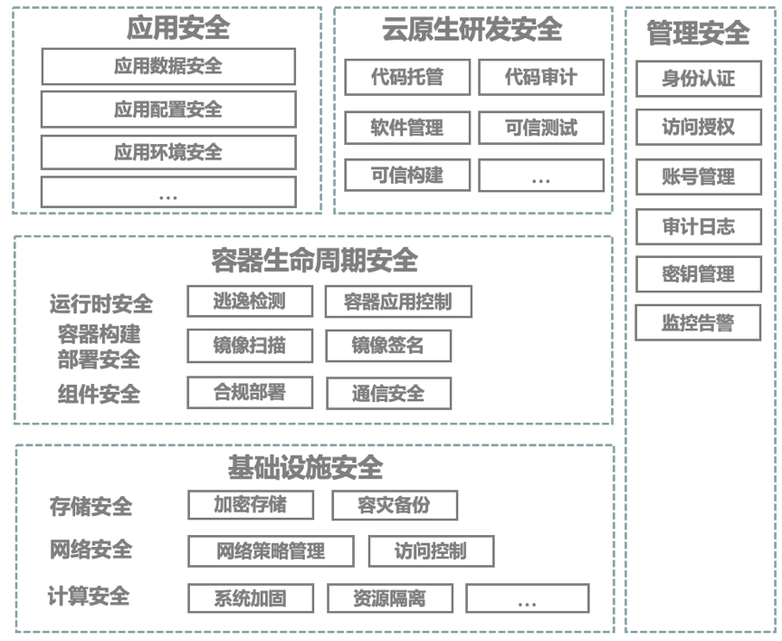

# (四)	云原生安全

根据Gartner研究预测，到2022年超过75％的全球企业将在生产环境中运行容器化应用。虽然以容器为核心的云原生技术发展速度空前增长，企业采用新兴技术的同时，也需要确保应用在全生命周期的各个关键环节尤其在生产环境运行时的安全问题。云原生技术作为企业数字业务应用创新的原动力，不仅被引入到云原生应用全生命周期管理中，而且被推到了生产环境。云原生技术为企业带来快速交付与迭代数字业务应用的优势之外，同时也带来了新的安全要求与挑战。

**传统的边界安全模型在动态变化的云原生环境难适用。** 云原生环境中应用微服务化大幅增加了内部网络流量和服务通信端口总量，同时承载负载的容器秒级启动或消失的动态变化，增加了安全监控和保护的难度，传统防火墙基于固定IP的安全策略很难适应这种持续的动态变化，无法准确捕捉容器间的网络流量和异常行为。

**容器共享操作系统的进程级隔离环境增加逃逸风险。** 传统软件架构下，应用之间通过物理机或虚拟机进行隔离，从安全角度来看可以将安全事件的影响限制在有限可控的范围内。在云原生环境下，多个服务实例共享操作系统，一个存在漏洞服务被攻陷可能会导致运行在同主机上其他服务受到影响，逃逸风险大大提高。

**频繁变更对软件流转的全链条安全提出新要求。** 为提高数字业务应用交付与运维效率，企业应用开发与运维部门引入开发运营一体化流程。每个微服务应用会涉及相对独立的开发、测试和部署的全生命周期，并通过持续集成/持续交付的流水线，将应用部署运行在开发测试和生产环境中。在整个业务应用全生命周期中，需要为各个环节引入自动化安全保护，不仅避免各个环节的潜在风险，而且提高应用安全交付效率。

**应用微服务化大幅增加攻击面。** 容器技术保证了运行环境的强一致性，为应用服务的拆分解耦提供了前提，应用微服务化进程加速，同时也带来新的安全隐患。单体应用拆分导致端口数量暴增，攻击面大幅增加。微服务将单体架构的传统应用拆分成众多个服务，应用间交互的端口成指数级增长，相较于单体应用架构集中在一道口防护的简单易行，微服务化应用在端口防护、访问权限、授权机制等方面的难度陡增。

针对上述云原生技术架构下的安全风险 ，云原生产业联盟CNIA联合业内技术专家共同提出云原生技术安全架构模型，用于建设服务之间零信任、具备统一的安全管理策略、软件流转可溯源的云原生安全体系，保证企业的研发运营环境安全。

